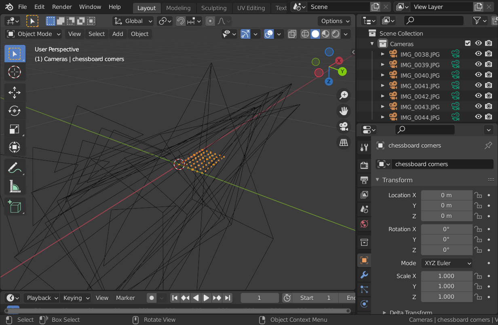
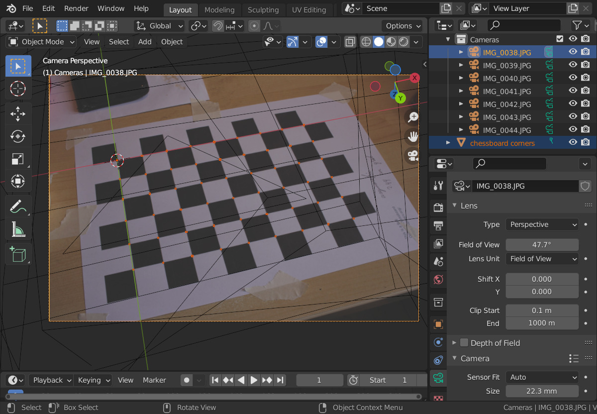

# OpenCV camera calibration scripts

Whenever I end up using OpenCV for some task that involves computer vision
the necessary camera calibration step is always a bit messy, due to having to
gather the necessary Python code to run the calibration (and never being really
sure the values are correct). Here, I tried to gather some useful scripts for 
that task, both for myself, but also for others to use.

Two scripts are included:

- `calibrate.py`: takes a set of input images and parameters and uses OpenCV to
  compute the camera calibration. The computed parameters can be saved to JSON,
  plus it allows writing debug images to see the detection of the chessboard used.
- `import_calibration_data.py`: reads a JSON calibration file and the set of images
  and constructs a Blender scene that creates a camera per image with the correct
  transform and background image.
  
Limitations:

- Only supports the checkerboard calibration pattern, two versions included, a
  symmetrical and an asymmetrical one. The asymmetrical version has the advantage
  of leading to consistent chessboard orientations being detected (all computed 
  camera positions on the same side of the chessboard).
- Tested with OpenCV 4.5.3 under Python 3.9.6 and OpenCV 4.8.0 under Python 3.11.5. 
  It probably will work with other versions, but it also might not.
  
Dependencies:

- Python 3.x
- OpenCV with Python module installed
- NumPy
- Blender 2.9x (for `import_calibration_data.py` only)

## Example usage (calibration)

Using the included test set in `canon-efs-24mm-crop1.6`:

```
$ cd canon-efs-24mm-crop1.6
# 9x6 inner corners in the chessboard, 2.44 cm between corners, 22.3x14.9 mm sensor size on the camera
$ ../calibrate.py -c 9x6 -s 0.0244 -j calib.json -S 22.3x14.9 -d debug *.JPG
Image resolution 5184x3456
Processing 7 images using 4 threads ....... done

Found chessboards in 7 out of 7 images

Calibrating camera using 7 images
RMS: 1.18165472725028

Camera matrix:
 [[5.86740909e+03 0.00000000e+00 2.59146647e+03]
 [0.00000000e+00 5.87687664e+03 1.72775387e+03]
 [0.00000000e+00 0.00000000e+00 1.00000000e+00]]

Distortion coefficients:
 [-0.12291868  0.17975773 -0.00165213 -0.00162771 -0.94774414]

Computing reprojection error:
[IMG_0038.JPG] 0.179007
[IMG_0039.JPG] 0.173196
[IMG_0040.JPG] 0.173777
[IMG_0041.JPG] 0.159977
[IMG_0042.JPG] 0.152262
[IMG_0043.JPG] 0.128836
[IMG_0044.JPG] 0.152934

Average reprojection error: 0.159998 +/- 0.016064

FOV: 47.668066 32.770231 degrees
Focal length: 25.239819 mm
Principal point: 11.147705 7.448939 mm
Aspect ratio: 1.001614

[IMG_0038.JPG] rotation (-0.630170, -0.100325, -0.255343), translation (-0.114111, -0.036871, 0.408347)
[IMG_0039.JPG] rotation (-0.658240, -0.084628, -0.160000), translation (-0.109105, -0.040644, 0.426521)
[IMG_0040.JPG] rotation (-0.677469, 0.150810, 0.345571), translation (-0.082676, -0.082905, 0.500609)
[IMG_0041.JPG] rotation (-0.731692, 0.299701, 0.657561), translation (-0.047673, -0.093889, 0.576458)
[IMG_0042.JPG] rotation (-0.602255, -0.013499, 0.000046), translation (-0.098538, -0.058739, 0.463666)
[IMG_0043.JPG] rotation (-0.039782, -0.004438, 0.005338), translation (-0.098927, -0.057666, 0.430095)
[IMG_0044.JPG] rotation (-0.818372, -0.007559, 0.001030), translation (-0.094439, -0.047858, 0.528516)

Writing undistorted images to debug directory:
IMG_0038.JPG
IMG_0039.JPG
IMG_0040.JPG
IMG_0041.JPG
IMG_0042.JPG
IMG_0043.JPG
IMG_0044.JPG
```

As can be seen the chessboard pattern is detected in all 7 input images. The
reconstructed calibration is quite good, at an average reprojection error of 0.16 pixels.

By setting the physical sensor size of the 60D camera used with the `-S` option the
FOV and focal length can be computed in physical units (instead of only in pixels,
as given by the camera matrix). The derived focal length is 25.2mm, which is pretty close
to the actual 24mm of the lens.

The `calib.json` file will contain all the computed calibration parameters, plus 
the transformation computed for each image (`chessboard_orientations`). 
Most of the input values are also stored in the JSON file, for completeness.

Due to the `-d debug` option the `debug` directory will contain three images for
each input image in which the chessboard was detected: a colored line overlay showing
the detected chessboard, the undistored image based on the detected camera parameters (both
in uncropped and cropped versions).

## Example usage (Blender scene)

```
$ cd canon-efs-24mm-crop1.6
$ blender -P ../import_calibration_data.py -- calib.json
```

This will read the calibration JSON file and construct a scene with:

- The chessboard corners as a set of vertices (the `chessboard corners` mesh)
- A quad textured as a chessboard (the `chessboard` mesh), which is hidden by default
- A camera for each image in which the chessboard was detected, transformed
  to match the detected orientation and position. The camera parameters will
  have been set to match the detected values from the calibration JSON file.

Here you can see the scene for the included test set:



The chessboard corner vertices are shown in orange and one corner is located
in the origin: this is the way the corner coordinates are specified in the
`calibrate.py` script. Note the axes orientation of the view: the chessboard corners 
lie in the XY plane, whereas the cameras are all located on the -Z side. This is due
to the raw OpenCV values being used, they're not transformed in any way.



Here the view of a single camera/image is shown. Note again the chessboard corner 
vertices in dark orange, which match very well with the background image of the 
selected camera. The camera parameters from the calibration file have been applied
to the Blender camera (horizontal sensor size 22.3 mm, horizontal FOV 47.7 degrees).

Again, note the axes orientation. By default, an untransformed OpenCV camera 
has +X pointing right, +Y pointing *down* and looks down the +Z axis.
As the top-left corner of the chessboard is in view and is located in the origin,
with the other corners along the +X and +Y directions the camera calibration
solution puts the camera on the -Z side.

